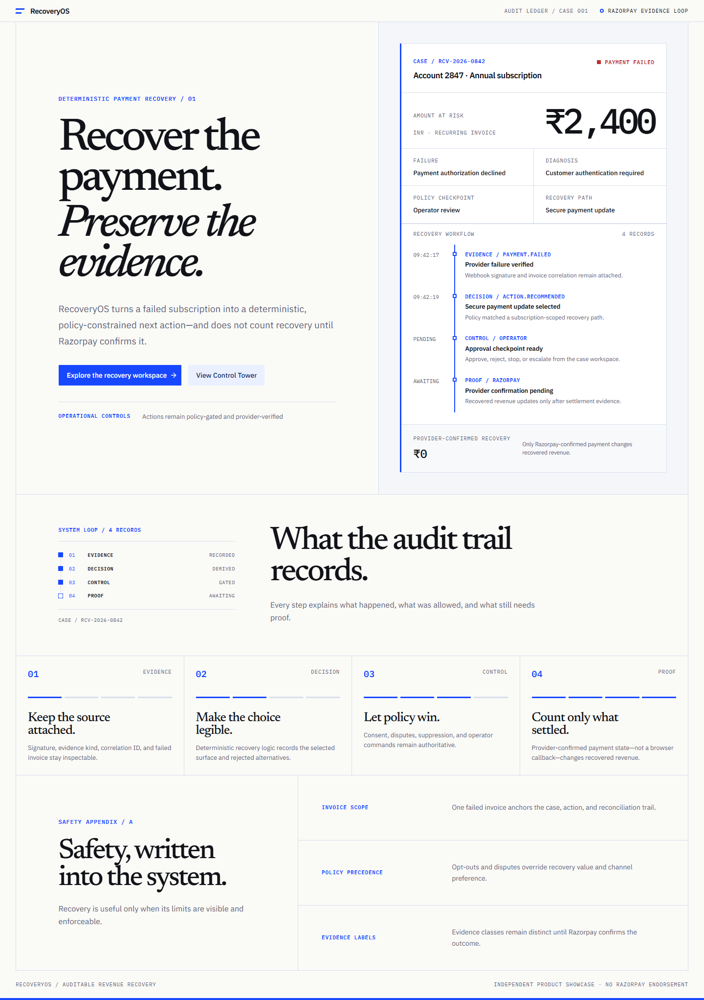
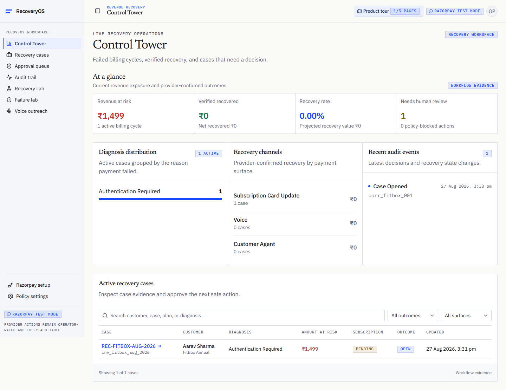
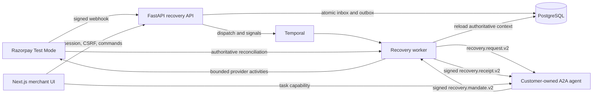

# RecoveryOS

**Auditable, agent-to-agent revenue recovery for failed Razorpay subscriptions.**

RecoveryOS is a revenue recovery platform for subscription merchants. It turns each failed
invoice into one durable case, explains the failure, ranks a bounded next action, applies merchant
policy, coordinates customer authorization, and records recovered revenue only after authoritative
provider evidence.

The design separates four concerns that are often collapsed into one unsafe automation:

1. **Evidence** describes what happened at the payment provider.
2. **Decision logic** recommends what to do next.
3. **Policy and customer authorization** decide what is allowed.
4. **Provider reconciliation** proves whether money was actually recovered.



## Why RecoveryOS is different

- **Customer-owned authorization:** RecoveryOS can negotiate with a separately operated customer
  agent over A2A. The customer agent signs a one-time, exact-scope Ed25519 mandate; RecoveryOS
  verifies it before opening the authorized payment surface.
- **Intelligence is not authority:** language interpretation and action ranking are advisory.
  Deterministic policy, explicit approval, exact monetary scope, and server-side flags remain in
  control.
- **Payment proof is authoritative:** redirects and browser callbacks never count as payment.
  RecoveryOS reconciles against Razorpay and signs a receipt only after provider-confirmed capture.
- **Retries are designed for financial safety:** webhook ingestion, Temporal signals, recovery
  actions, mandate nonces, provider submissions, and revenue attribution have explicit idempotency
  boundaries.
- **Every decision is inspectable:** evidence, rejected alternatives, policy snapshots, approvals,
  commands, provider observations, and final outcomes appear in one invoice-scoped audit trail.

## Live hackathon deployment

The backend is deployed as two independently healthy Render services. The Next.js frontend is not
publicly hosted yet and is currently run locally against these services.

| Service             | URL                                                                                                        | Verified state                                                                        |
| ------------------- | ---------------------------------------------------------------------------------------------------------- | ------------------------------------------------------------------------------------- |
| RecoveryOS API      | [recoveryos-api-1p1c.onrender.com](https://recoveryos-api-1p1c.onrender.com)                               | Live and ready                                                                        |
| API readiness       | [/health/ready](https://recoveryos-api-1p1c.onrender.com/health/ready)                                     | Merchant scope, PostgreSQL, Temporal, deterministic scorer, and embedded worker ready |
| API documentation   | [/docs](https://recoveryos-api-1p1c.onrender.com/docs)                                                     | FastAPI OpenAPI interface                                                             |
| Recovery Agent Card | [/.well-known/agent-card.json](https://recoveryos-api-1p1c.onrender.com/.well-known/agent-card.json)       | A2A 1.0 contract                                                                      |
| Customer Agent      | [recoveryos-customer-agent.onrender.com](https://recoveryos-customer-agent.onrender.com)                   | Live; SQL task store and configured signing mode ready                                |
| Customer Agent Card | [/.well-known/agent-card.json](https://recoveryos-customer-agent.onrender.com/.well-known/agent-card.json) | A2A 1.0 contract                                                                      |

These endpoints were verified on **3 September 2026**. Render free services may need a cold-start
request before they respond at normal latency.

### Current hosted runtime boundary

The hosted API currently reports:

- `payment_provider=razorpay`, with Razorpay test credentials required
- `a2a_enabled=true`
- an embedded Temporal worker that is polling successfully
- the deterministic recovery scorer, reported as `deterministic_fallback`
- `recovery_activity_mode=mock`

This means signed Razorpay test webhooks, database correlation, case persistence, deterministic
ranking, Temporal orchestration, provider reconciliation, and the signed A2A client are active. The
hosted activity adapter is still configured in deterministic mode, so this deployment does not
claim production money movement or SQL-backed provider action execution. Razorpay remains visibly
and server-side restricted to **Test Mode**.

Agent Card availability alone is not an A2A end-to-end health check. A2A execution is controlled by
its own feature flag, signer configuration, customer eligibility, and workflow state.

## What the application does

### Razorpay intake and correlation

- Synchronizes a Razorpay test subscription, plan, customer, and invoices into the configured
  merchant scope before related events are processed.
- Accepts `payment.failed`, `subscription.pending`, `subscription.halted`,
  `subscription.charged`, `payment.captured`, and `payment_link.paid`.
- Verifies the HMAC-SHA256 webhook signature over the untouched request bytes before JSON parsing.
- Persists an atomic inbox and outbox record and returns `202 Accepted`; duplicate event IDs return
  the original persisted identity.
- Processes outbox rows with database locking and retries failed correlation or dispatch with
  exponential backoff.

### Durable recovery cases

- Maintains independent payment, invoice, subscription, contact, authorization, and workflow
  states instead of deriving one from another.
- Creates one Temporal workflow per recovery case with the stable ID
  `recovery-case:{case_id}`.
- Handles payment evidence, approvals, customer intent, opt-out, cancellation, escalation, A2A
  updates, and signed mandate signals with replay-safe signal IDs.
- Uses durable timers and persists the action and policy snapshot before workflow dispatch.
- Limits ordinary activities to bounded retries. Provider submissions are attempted once and then
  reconciled, preventing blind re-submission after an ambiguous response.

### Deterministic decision and policy engine

The current default and hosted decision path is deterministic. It diagnoses provider evidence into
conservative categories such as authentication required, insufficient funds, invalid instrument,
transient failure, risk or compliance, merchant failure, and unknown.

For each case, RecoveryOS enumerates only technically executable actions:

- wait for the provider-managed retry
- open a customer-present subscription invoice or card-update surface
- request customer-agent authorization
- start a guarded voice flow
- escalate to a human operator
- stop recovery

Candidates are scored with stable integer-paise expected value and utility calculations. The audit
record keeps their order, features, rejection reasons, and scorer version. Deterministic policy is
the final gate and can reject the highest-ranked action.

The repository also contains RecoveryBench and a checksum-verified CatBoost integration for
offline evaluation. It is **not** the active hosted ranker. Setting `RECOVERY_MODEL_REQUIRED=false`
selects the rules-based scorer and keeps readiness non-blocking; model-required mode is an explicit
opt-in.

### Merchant safety controls

The policy engine enforces:

- global and merchant kill switches
- captured, recovered, cancelled, and terminal-state suppression
- opt-out, wrong-person, dispute, and already-paid precedence
- recovery deadlines and active gateway retry windows
- seven-day contact limits and merchant-timezone quiet hours
- action-specific and amount-specific approval requirements
- operator approval, rejection, stop, and escalation commands

`STOP` and `ESCALATE` remain available even when payment or contact actions are disabled.

### Customer-agent A2A authorization

RecoveryOS implements an A2A 1.0 recovery protocol between the merchant recovery agent and a
separately owned customer agent. The repository deploys the customer agent from
`services/customer-agent` as its own service, database-backed task store, signing identity, and
browser origin.

The protocol supports `SendMessage`, `GetTask`, and `CancelTask`:

1. The worker rebuilds the current case, invoice, customer, subscription, action, and policy from
   PostgreSQL.
2. It sends a `recovery.request.v2` containing sanitized case context and the proposed payment
   surface.
3. The customer agent creates an authorization-required task and returns a task-scoped approval
   capability in the URL fragment.
4. The approval page removes that capability from the visible URL, keeps it in memory, and repeats
   the merchant, failed invoice, exact amount, currency, and payment surface.
5. Optional language interpretation can classify the customer's message as approve, reject, ask a
   question, or unclear. It always has `authorization_effect: NONE`.
6. Only an explicit approval signs a `recovery.mandate.v2` with Ed25519.
7. RecoveryOS verifies the pinned key, task, merchant, case, customer, action, invoice, exact integer
   amount, currency, provider reference, issue time, expiry, mandate ID, and nonce.
8. PostgreSQL atomically consumes the nonce. Identical workflow retries are idempotent; changed
   reuse is rejected.
9. After authoritative payment capture, RecoveryOS signs a `recovery.receipt.v2` and sends it back.
10. The customer agent verifies the separately pinned RecoveryOS key and exact mandate scope before
    completing the task.

The LLM boundary is intentionally narrow. It receives sanitized display context, not the exact
payment scope or internal financial identifiers. Provider failures fail closed, and no model output
can change task state, sign a mandate, or authorize a payment.

Compatible customer-managed agents can implement the published Agent Card and JSON-RPC contract.
The current build connects to one configured customer-agent origin and uses pinned public keys. It
does not yet provide a per-customer agent registry, dynamic trust discovery, streaming, or push
notifications. The current mandate authorizes an existing customer-present subscription invoice
surface; it is not a Razorpay or RBI recurring e-mandate and does not directly charge a card.

### Provider-confirmed recovery

- Customer-present card-update and subscription-invoice surfaces preserve Razorpay as the payment
  authority.
- Standard Payment Links are blocked while a gateway-managed retry is active.
- Uncertain Payment Link creation is reconciled by a stable reference before another submission.
- Captured events trigger a fresh Razorpay invoice, payment, and subscription fetch.
- A unique revenue-ledger boundary prevents a duplicated success event from counting twice.
- All monetary values remain integer paise throughout storage, contracts, scoring, and receipts.

### Voice and failure evaluation

- The Voice workspace supports browser-based intent rehearsal and persists consent, limits, call
  status, transcripts, intent, promise-to-pay, and stop state.
- Real calling has separate provider, allowlist, operator-token, concurrency, duration, daily-limit,
  and kill-switch controls. It is disabled in the hosted blueprint.
- The Failure Lab exercises duplicate, delayed, out-of-order, stale, and ambiguous-event behavior
  against the API.
- RecoveryBench provides fixed-seed offline evaluation and calibration reports. Benchmark outcomes
  are isolated from provider-confirmed recovered revenue.

## Product surfaces

The frontend uses a light audit-ledger visual system: warm paper, near-black ink, cobalt evidence
signals, square geometry, Newsreader headings, IBM Plex Sans body text, and IBM Plex Mono labels.

| Route                            | Purpose                                                                                      |
| -------------------------------- | -------------------------------------------------------------------------------------------- |
| `/`                              | Anonymized product narrative showing how one failed invoice moves through the recovery loop  |
| `/login`                         | Server-configured operator sign-in                                                           |
| `/dashboard`                     | Control Tower metrics, active cases, diagnoses, recovery channels, and recent audit events   |
| `/cases/[caseId]`                | Evidence, recommendation, policy reasoning, payment surface, commands, and complete timeline |
| `/approvals`                     | Human review for actions that require exact-scope approval                                   |
| `/settings`                      | Policy, quiet hours, contact limits, approval gates, and global kill switch                  |
| `/setup`                         | Razorpay test subscription synchronization and provider links                                |
| `/lab`                           | RecoveryBench offline evaluation and calibration report                                      |
| `/failure-lab`                   | Controlled convergence and idempotency scenarios                                             |
| `/voice`                         | Intent rehearsal and separately guarded real-call controls                                   |
| `/a2a/[taskId]`                  | Customer authorization for one exact payment surface                                         |
| `/payments/razorpay/card-update` | Customer-present Razorpay card-update checkout; callback is never payment proof              |



## Architecture



The governing rule is:

> **Evidence informs the decision. Policy and explicit authorization permit the action. Deterministic
> code executes it. Provider reconciliation confirms the outcome. The audit trail records all of it.**

### Backend interfaces

| Boundary             | Primary interfaces                                                                                           |
| -------------------- | ------------------------------------------------------------------------------------------------------------ |
| Health               | `/health`, `/health/live`, `/health/ready`                                                                   |
| Operator access      | `/v1/operator/session` and `/v1/operator/session/current`                                                    |
| Recovery workspace   | `/v1/dashboard/metrics`, `/v1/recovery-cases`, case detail, timeline, commands, approvals, and policy routes |
| Razorpay             | `/v1/webhooks/razorpay` and `/v1/razorpay/test-onboarding/*`                                                 |
| Recovery Agent       | `/.well-known/agent-card.json` and `/a2a/rpc`                                                                |
| Customer Agent       | `/.well-known/agent-card.json`, `/rpc`, and `/v1/tasks/{task_id}/*`                                          |
| Evaluation and voice | `/v1/lab/*` and `/v1/voice/*`                                                                                |

## Repository map

```text
apps/web/                    Next.js merchant and customer-facing interface
services/api/                FastAPI routes, domain services, persistence, integrations, migrations
services/worker/             Temporal workflow, activities, A2A, Razorpay, and voice runtimes
services/customer-agent/     Independently deployed A2A customer authorization service
packages/contracts/          Generated OpenAPI contract
ml/recoverybench/            Offline benchmark, CatBoost experiment, reports, and artifacts
infra/temporal/              Temporal configuration and operational assets
docs/                        Architecture, product, security, runbooks, and submission material
tests/                       Repository-level tests and security checks
```

The current Alembic head is `e7a2c14f58d1`. Render runs `alembic upgrade head` before starting the
API process.

## Technology stack

| Layer                   | Technology                                                                         |
| ----------------------- | ---------------------------------------------------------------------------------- |
| Web                     | Next.js 16, React 19, TypeScript 5.9, Tailwind CSS 4, shadcn components on Base UI |
| API                     | Python 3.12, FastAPI, Pydantic, SQLAlchemy, Alembic                                |
| Persistence             | PostgreSQL with async application access and transactional inbox/outbox patterns   |
| Orchestration           | Temporal workflows, signals, durable timers, activity retry policies               |
| Payments                | Razorpay APIs and signed webhooks, restricted to Test Mode                         |
| Agent protocol          | A2A 1.0 JSON-RPC, Agent Cards, Ed25519 mandates and receipts                       |
| Advisory language layer | Structured, fail-closed LLM interpretation behind an adapter                       |
| Testing                 | Pytest, Vitest, Testing Library, Playwright desktop and mobile projects            |
| Deployment              | Render blueprint for both Python services; Vercel-ready Next.js application        |

## Run locally

### Prerequisites

- Node.js 22 LTS
- pnpm 10.15.1
- Python 3.12
- [`uv`](https://docs.astral.sh/uv/)
- PostgreSQL
- a Temporal server or Temporal Cloud namespace

Docker is not required by this repository.

### 1. Install dependencies

```powershell
pnpm install --frozen-lockfile
uv sync --all-groups
```

Or run the repository bootstrap shortcut:

```powershell
pnpm bootstrap
```

### 2. Configure the backend

Copy the environment contract and fill the required values:

```powershell
Copy-Item .env.example .env
```

Keep these safe defaults unless you are intentionally exercising a guarded integration:

```dotenv
PAYMENT_PROVIDER=mock
RECOVERY_ACTIVITY_MODE=mock
RECOVERY_ALLOW_REAL_PAYMENT_ACTIONS=false
RECOVERY_EMBEDDED_WORKER=false
RAZORPAY_TEST_MODE_REQUIRED=true
A2A_ENABLED=false
VOICE_PROVIDER=mock
VOICE_REAL_CALLS_ENABLED=false
RECOVERY_MODEL_REQUIRED=false
```

The canonical variable list and inline guidance live in [`.env.example`](.env.example). Never
commit `.env`, `.env.local`, private keys, bearer tokens, database URLs, provider secrets, or API
keys.

### 3. Configure the frontend

Create `apps/web/.env.local`:

```dotenv
NEXT_PUBLIC_DATA_MODE=live
NEXT_PUBLIC_API_BASE_URL=http://localhost:8000
CUSTOMER_AGENT_ORIGIN=http://localhost:8010
```

`live` mode fails visibly when the API is unavailable and never silently substitutes bundled
fixtures. `NEXT_PUBLIC_RECOVERY_API_URL` can optionally point only the Recovery Lab at another API
origin.

To run the frontend locally against the hosted services instead:

```dotenv
NEXT_PUBLIC_DATA_MODE=live
NEXT_PUBLIC_API_BASE_URL=https://recoveryos-api-1p1c.onrender.com
CUSTOMER_AGENT_ORIGIN=https://recoveryos-customer-agent.onrender.com
```

The backend `WEB_ORIGIN`, Razorpay `RAZORPAY_CHECKOUT_ORIGIN`, and customer-agent
`CUSTOMER_AGENT_WEB_ORIGIN` must allow the exact frontend origin. Credentialed CORS does not allow
wildcards.

### 4. Prepare PostgreSQL

```powershell
pnpm db:check
pnpm migrate
```

`pnpm seed` is limited to an explicitly enabled local mock environment. It is not part of the
hosted startup path.

### 5. Start the services

Run each command in a separate terminal:

```powershell
pnpm dev:api
pnpm dev:worker
pnpm dev:customer-agent
pnpm dev:web
```

Open [http://localhost:3000](http://localhost:3000). If
`RECOVERY_EMBEDDED_WORKER=true`, the API process starts the Temporal worker and Razorpay outbox
poller, so a separate `pnpm dev:worker` process is unnecessary.

`pnpm dev` currently starts the web application only.

## Configuration map

Values belong in the root `.env` for local processes, in the corresponding Render service's
environment for hosted backends, and in `apps/web/.env.local` or the frontend host for Next.js.

| Boundary                | Variables                                                                                                                                                                                                                                                                                                                                                                                                                                                                |
| ----------------------- | ------------------------------------------------------------------------------------------------------------------------------------------------------------------------------------------------------------------------------------------------------------------------------------------------------------------------------------------------------------------------------------------------------------------------------------------------------------------------ |
| Application and browser | `APP_ENV`, `DEMO_MODE`, `SERVICE_NAME`, `APP_VERSION`, `API_HOST`, `API_PORT`, `LOG_LEVEL`, `WEB_ORIGIN`, `NEXT_PUBLIC_DATA_MODE`, `NEXT_PUBLIC_API_BASE_URL`, `NEXT_PUBLIC_RECOVERY_API_URL`                                                                                                                                                                                                                                                                            |
| PostgreSQL and Temporal | `DATABASE_URL`, `TEMPORAL_ADDRESS`, `TEMPORAL_NAMESPACE`, `TEMPORAL_TASK_QUEUE`, `TEMPORAL_TLS`, `TEMPORAL_API_KEY`, `HEALTHCHECK_TIMEOUT_SECONDS`                                                                                                                                                                                                                                                                                                                       |
| Merchant scope          | `RECOVERY_MERCHANT_ID`, `RECOVERY_MERCHANT_DISPLAY_NAME`, `RECOVERY_MERCHANT_EXTERNAL_ID`, `RECOVERY_MERCHANT_TIMEZONE`, `RECOVERY_MERCHANT_CURRENCY`                                                                                                                                                                                                                                                                                                                    |
| Operator session        | `OPERATOR_AUTH_REQUIRED`, `OPERATOR_DEMO_EMAIL`, `OPERATOR_DEMO_TOKEN`, `OPERATOR_SESSION_SECRET`, `OPERATOR_COOKIE_SECURE`, `OPERATOR_COOKIE_SAMESITE`                                                                                                                                                                                                                                                                                                                  |
| Razorpay and execution  | `PAYMENT_PROVIDER`, `RECOVERY_ACTIVITY_MODE`, `RECOVERY_ALLOW_REAL_PAYMENT_ACTIONS`, `RECOVERY_EMBEDDED_WORKER`, `RECOVERY_EMBEDDED_WORKER_STARTUP_TIMEOUT_SECONDS`, `RECOVERY_GLOBAL_KILL_SWITCH`, `RAZORPAY_KEY_ID`, `RAZORPAY_KEY_SECRET`, `RAZORPAY_WEBHOOK_SECRET`, `RAZORPAY_API_BASE_URL`, `RAZORPAY_CHECKOUT_ORIGIN`, `RAZORPAY_OUTBOX_POLL_SECONDS`, `RAZORPAY_TEST_MODE_REQUIRED`                                                                              |
| Decision runtime        | `RECOVERY_MODEL_REQUIRED`, `RECOVERYBENCH_ARTIFACT_DIR`                                                                                                                                                                                                                                                                                                                                                                                                                  |
| Recovery-side A2A       | `A2A_ENABLED`, `RECOVERY_AGENT_ORIGIN`, `RECOVERY_AGENT_A2A_INBOUND_BEARER_TOKEN`, `CUSTOMER_AGENT_ORIGIN`, `CUSTOMER_AGENT_S2S_BEARER_TOKEN`, `CUSTOMER_AGENT_PUBLIC_KEYS_JSON`, `RECOVERY_AGENT_RECEIPT_SIGNING_MODE`, `RECOVERY_AGENT_RECEIPT_SIGNER_KEY_ID`, `RECOVERY_AGENT_RECEIPT_ED25519_PRIVATE_KEY`                                                                                                                                                            |
| Customer agent          | `CUSTOMER_AGENT_WEB_ORIGIN`, `CUSTOMER_AGENT_SIGNER_KEY_ID`, `CUSTOMER_AGENT_ED25519_PRIVATE_KEY`, `CUSTOMER_AGENT_REAL_SIGNING_ENABLED`, `CUSTOMER_AGENT_APPROVAL_TOKEN_SECRET`, `CUSTOMER_AGENT_REQUEST_TTL_SECONDS`, `CUSTOMER_AGENT_TASK_STORE`, `CUSTOMER_AGENT_DATABASE_URL`, `CUSTOMER_AGENT_RECEIPT_VERIFICATION_MODE`, `CUSTOMER_AGENT_RECOVERY_AGENT_PUBLIC_KEYS_JSON`, `LLM_PROVIDER`, `OPENAI_API_KEY`, `OPENAI_MODEL`, `CUSTOMER_AGENT_LLM_TIMEOUT_SECONDS` |
| Voice                   | `VOICE_PROVIDER`, `VOICE_REAL_CALLS_ENABLED`, `VOICE_OPERATOR_TOKEN`, `VOICE_ALLOWLIST_DESTINATIONS`, `VOICE_PUBLIC_ORIGIN`, `TWILIO_ACCOUNT_SID`, `TWILIO_AUTH_TOKEN`, `TWILIO_FROM_NUMBER`, `ELEVENLABS_API_KEY`, `ELEVENLABS_AGENT_ID`, `ELEVENLABS_WEBHOOK_SECRET`, `VOICE_MAX_CONCURRENT_CALLS`, `VOICE_MAX_CALL_SECONDS`, `VOICE_DAILY_CALL_LIMIT`                                                                                                                 |

The main API and customer agent require different private signing keys and pin only each other's
public keys. See the [customer-agent service documentation](services/customer-agent/README.md) for
the exact trust split and lifecycle.

## Authentication and browser security

- The API can issue an eight-hour HMAC-signed HttpOnly operator cookie and returns a matching CSRF
  token for consequential browser mutations.
- Non-mock providers or enabled real payment actions force operator authentication even when
  `OPERATOR_AUTH_REQUIRED=false`.
- The shared header token is supported for controlled service or test access.
- Cross-site frontend and API deployments require `SameSite=None` together with `Secure=true` and
  exact HTTPS CORS origins.
- The A2A browser capability is scoped to one task, delivered in the URL fragment, removed after
  reading, kept out of browser storage, and never accepted in the query string.

The current build uses one configured merchant and one server-configured operator account. It does
not claim production identity, RBAC, self-service multi-tenancy, or legally verified customer
identity. Read-only recovery views are not yet tenant-hardened; consequential mutations remain at
the authenticated API boundary.

## Health and deployment behavior

### RecoveryOS API

- `GET /health` and `GET /health/live` prove process liveness without checking dependencies.
- `GET /health/ready` checks merchant scope, PostgreSQL, Temporal, the selected recovery scorer,
  and embedded-worker polling when embedded mode is active.
- Readiness does not call the customer agent directly.

### Customer agent

- `GET /health/live` proves process liveness.
- `GET /health/ready` verifies the selected task store and confirms the SQL task table exists when
  SQL mode is active.
- Readiness does not call the language model provider or RecoveryOS API.

[`render.yaml`](render.yaml) defines both Python 3.12 services. The API applies Alembic migrations
before Uvicorn starts; the customer agent starts independently and shares the configured
PostgreSQL service in SQL mode. An invalid Temporal, provider, activity, or A2A configuration can
still prevent embedded-worker startup, which is intentionally visible through readiness.

The Next.js application includes [Vercel configuration](apps/web/vercel.json). Once it is hosted,
set its public API and customer-agent origins, then replace the three localhost browser origins in
the backend services with the exact HTTPS frontend origin.

## Validation

Run the narrowest relevant suite while iterating, then the repository gates:

```powershell
pnpm lint
pnpm format:check
pnpm typecheck
pnpm test
pnpm e2e
pnpm build
pnpm generate:openapi
git diff --exit-code -- packages/contracts/openapi.json
```

The CI workflow covers web lint, type checking, unit tests and build; Python Ruff, formatting,
mypy and Pytest; OpenAPI drift; desktop and mobile Playwright flows; migration checks; dependency
audits; secret scanning; and repository-history security checks.

During this README audit, the focused verification passed:

- 58 frontend unit tests
- 55 backend health, worker, decision, webhook, workflow, and runtime tests
- 28 A2A, signing, LLM-boundary, and payment-runtime tests
- both deployed services' liveness and readiness probes

## Current scope and limitations

- Razorpay is limited to Test Mode. This project does not move production money.
- The hosted activity runtime is currently deterministic/mock even though webhook intake,
  persistence, Temporal, reconciliation, and A2A are live.
- A2A currently targets one configured customer-agent origin and requires a customer record marked
  as agent-capable.
- Public keys are pinned through server configuration; they are not trusted dynamically from an
  incoming Agent Card.
- The approval capability proves possession of a task link, not legal identity.
- Voice is not part of the automatic initial recommendation and real calls are disabled by default.
- The webhook outbox retries correlation failures but does not yet have a maximum-attempt dead-letter
  cutoff.
- The deployment is a single-merchant hackathon environment with shared operator authentication,
  not a production multi-tenant service.
- No measured production revenue uplift is claimed. Only provider-confirmed test transactions are
  eligible for recovered-revenue attribution.

RecoveryOS is an independent project and is not affiliated with or endorsed by Razorpay.

## Documentation

- [Product specification](docs/product/product-specification.md)
- [System architecture](docs/architecture/system-architecture.md)
- [Data flows](docs/architecture/data-flows.md)
- [API and webhook setup](docs/contracts/api-webhook-setup.md)
- [Customer-agent protocol and operations](services/customer-agent/README.md)
- [RecoveryBench model card](docs/model/recoverybench-model-card.md)
- [Threat model](docs/security/threat-model.md)
- [Phase 5 final audit](docs/audit/phase-5-final-audit.md)
- [Five-minute walkthrough](docs/demo/five-minute-demo.md)
- [Frontend deployment](docs/deployment/vercel.md)
- [Uptime monitoring](docs/runbooks/uptime-monitoring.md)
- [Independent-project disclaimer](docs/submission/disclaimer.md)

## License

No open-source license has been selected. All rights remain reserved until a license is added.
