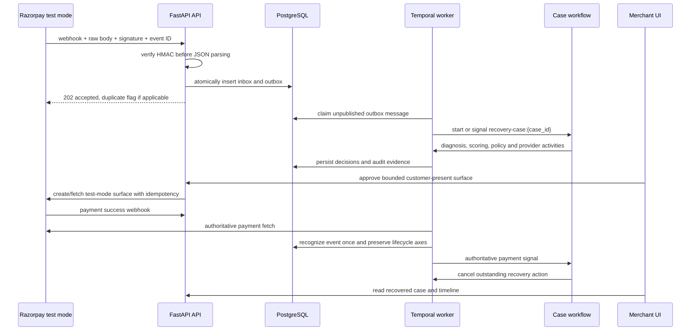
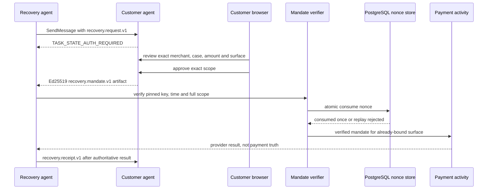
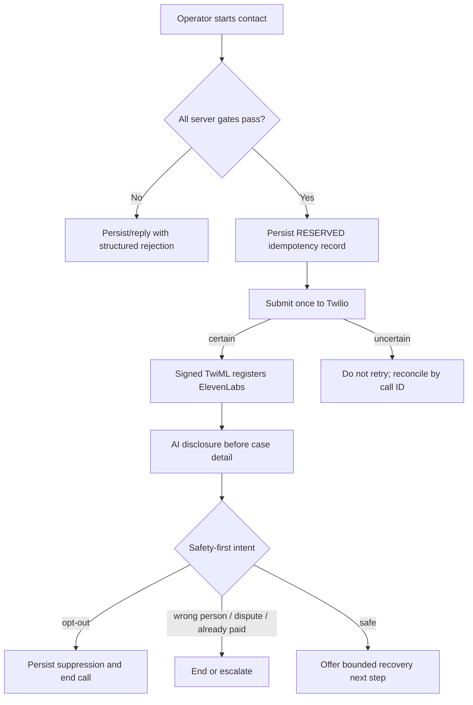

# Critical data flows

## Failed payment to authoritative recovery contract

Duplicates return the existing inbox/outbox identifiers. Out-of-order failures cannot regress a
captured payment. `WAIT_FOR_GATEWAY_RETRY` never charges a failed payment ID; Razorpay owns pending
subscription retries. A standard Payment Link is blocked while those retries are active.

## Exact A2A authorization

The mandate authorizes one exact payment surface; it does not authorize an LLM to charge. The
customer still completes the provider-owned surface. The customer-agent task store is process-local
in this release, so multi-instance hosting is a production blocker; nonce replay protection is
durable in PostgreSQL.

## Guarded voice contact

Real calling requires all of: Twilio provider selection, explicit real-call flag, operator token,
allowlisted destination token, recorded consent, allowed local time, kill switch off, one-call
concurrency, ten-call daily budget, and a duration no greater than 180 seconds. Browser text/audio
rehearsal remains available in mock mode.

These diagrams describe the implemented boundaries and their required composition. In the current
runtime, webhook reconciliation and merchant-triggered Razorpay surfaces are integrated, while the
Temporal action service remains mock-backed. A2A delegation, customer approval, mandate
verification, and nonce consumption pass component/E2E tests, but the approved-task-to-workflow
bridge is not yet wired.
