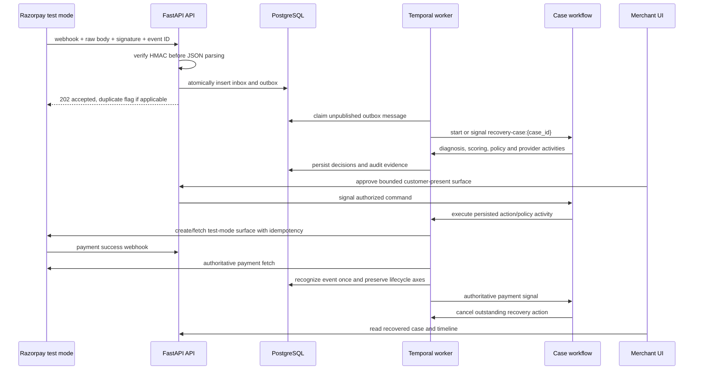
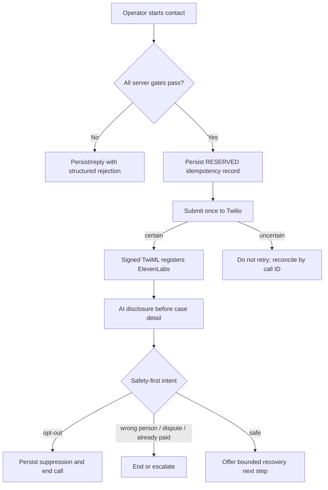

# Critical data flows

## Failed payment to authoritative recovery contract



Duplicates return the existing inbox/outbox identifiers. Out-of-order failures cannot regress a
captured payment. `WAIT_FOR_GATEWAY_RETRY` never charges a failed payment ID; Razorpay owns pending
subscription retries. A standard Payment Link is blocked while those retries are active. Before
creating a standard link, the activity persists its `EXECUTING` action. If submission is uncertain,
the workflow performs a bounded reconciliation by the unique reference ID; it never blindly repeats
the create request. Stop/deadline cleanup cancels an unpaid standard link, while native invoice and
card-update surfaces remain provider-owned.

## Exact A2A authorization

```mermaid
sequenceDiagram
    participant R as Recovery agent
    participant C as Customer agent
    participant B as Customer browser
    participant L as OpenAI Responses API
    participant V as Mandate verifier
    participant D as PostgreSQL nonce store
    participant P as Payment activity

    R->>C: S2S Bearer + SendMessage with recovery.request.v2
    Note over R,C: exact recovery_action_id + failed_invoice_id + amount + surface
    C-->>R: TASK_STATE_AUTH_REQUIRED + fragment-scoped approval capability
    B->>C: fragment removed; capability forwarded as Bearer
    C-->>B: exact scope and DB-derived context
    opt advisory language interpretation
        B->>C: customer text or voice transcript
        C->>L: text + display-only context (no exact payment claims)
        L-->>C: structured advisory intent
        C-->>B: authorization_effect NONE; explicit approval still required
    end
    B->>C: approve exact scope
    C-->>R: Ed25519 recovery.mandate.v2 artifact
    R->>V: verify pinned key, time and full scope
    V->>D: atomic consume nonce and canonical claim
    D-->>V: identical retry or conflicting replay result
    V->>P: verified mandate for already-bound action, invoice and surface
    P-->>R: provider result, not payment truth
    R->>C: S2S Bearer + signed recovery.receipt.v2 after authoritative result
```

The S2S credential authenticates the calling service; it is not customer authorization. The
task-scoped HMAC capability is delivered in the URL fragment, removed by the browser, and forwarded
only in the HTTP Authorization header to protect the approval and interpretation routes. The
mandate authorizes one exact persisted recovery action, failed invoice, amount, currency, and
payment surface; it does not authorize an LLM to charge. OpenAI can only interpret customer
language using display-only context, and its structured result has no authorization effect. The
customer must still submit the exact explicit decision and complete the provider-owned surface.

Hosted environments select the SQL-backed customer-agent task store in Supabase, so task, approval,
artifact, and receipt state survives process restart. Nonce and canonical claim consumption is
independently atomic in PostgreSQL. Only an authoritative recovered result causes the worker to send
the pinned-key Ed25519, idempotent `recovery.receipt.v2` with the same `recovery_action_id` and
`failed_invoice_id` and complete the customer task.

## Guarded voice contact



Real calling requires all of: Twilio provider selection, explicit real-call flag, operator token,
allowlisted destination token, recorded consent, allowed local time, kill switch off, one-call
concurrency, ten-call daily budget, and a duration no greater than 180 seconds. Browser text/audio
rehearsal remains available in mock mode.

These diagrams describe the implemented runtime composition. Mock mode remains the default;
production activity mode selects SQL persistence, the configured payment adapter, RecoveryBench
scoring, and voice cancellation behind the Temporal workflow. A separate explicit A2A flag selects
live delegation/verification/receipt. Live customer-agent calls require S2S Bearer authentication;
real signing additionally requires a task-scoped approval-capability secret. The local real-service
gate covers that A2A bridge with durable tasks. Provider credentials, OpenAI configuration, public
origins, and hosted smoke evidence remain separate external gates.
