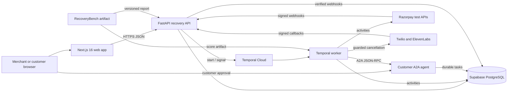

# System architecture

RecoveryOS separates merchant UX, financial truth, durable orchestration, provider adapters, and
customer authorization. External calls and non-determinism stay in activities or API adapters;
Temporal workflow code contains only deterministic state and timers.

The target hosted topology places the web app on Vercel, stores application state in Supabase
PostgreSQL, and uses Temporal Cloud for workflow history. The API, worker, and customer-agent still
require a non-sleeping Python hosting platform; that platform has not yet been selected or verified.

## Runtime responsibilities

| Runtime         | Owns                                                                                                   | Must not own                                                       |
| --------------- | ------------------------------------------------------------------------------------------------------ | ------------------------------------------------------------------ |
| Next.js web     | Control Tower, case workspace, policy UI, lab, voice rehearsal, A2A approval page                      | business authorization, payment truth, server secrets              |
| FastAPI API     | operator session/CSRF, queries, command signals, raw webhook intake, callback ingress                  | browser-trusted payment completion or duplicate provider execution |
| Temporal worker | durable orchestration, SQL/payment/A2A activities, reconciliation, voice cancellation                  | direct network calls or non-determinism in workflow code           |
| PostgreSQL      | cases, independent state axes, audit, inbox/outbox, revenue, policy, nonce/voice/customer-task records | card credentials, OTPs, banking secrets                            |
| Customer agent  | durable exact-scope customer decision, signed mandate, and authoritative recovery receipt              | payment execution or independent payment-success claims            |
| RecoveryBench   | fixed-seed training/evaluation report and optional score artifact                                      | mutation of merchant accounting                                    |

## Durable workflow boundary

Each case runs as `recovery-case:{case_id}` using workflow type `recovery.case.v1`. The workflow
accepts payment, customer-intent, approval, opt-out, cancellation, A2A-update, and mandate signals.
Signal IDs are deduplicated. Standard activities have a 30-second timeout and at most three attempts;
provider submissions use one attempt because an ambiguous response may hide a completed external
action. Reconciliation and cancellation remain available when provider-creation circuit breakers
are open.

## Persistence and accounting

A case is keyed by merchant plus failed invoice, or merchant plus subscription and billing-cycle key
when no invoice exists. Payment, subscription, case, contact, and revenue states are independent.
The webhook inbox and outbox are written atomically. Revenue is unique on merchant, provider, and
provider event ID; all amounts are integer paise. A browser callback is navigation, never proof of
payment.

The database currently has one Alembic head, `b160d73bfe19`, covering the core schema, policy
settings, voice persistence, A2A nonce consumption, and durable customer-agent tasks.

## Current composition and external gates

The worker entry point selects mock activity services by default. Explicit
`RECOVERY_ACTIVITY_MODE=production` composes SQL-backed activities with the selected payment provider
and RecoveryBench scorer. `A2A_ENABLED=true` independently selects the live customer-agent
client/verifier, and recovered cases invoke the configured voice cancellation boundary. Merchant
commands signal the single case workflow. The A2A activity polls the approved artifact, verifies
exact scope, consumes its nonce atomically, opens only the bound provider-owned surface, and sends an
idempotent receipt after authoritative recovery.

That composition passes local service-level gates; it does not prove hosted infrastructure or a
credentialed provider path. Public origins, backend hosting, Temporal Cloud, Razorpay test
credentials, and allowlisted Twilio/ElevenLabs credentials remain external gates. Production also
requires real identity, tenant authorization, privacy/retention operations, and provider/regulatory
review.
