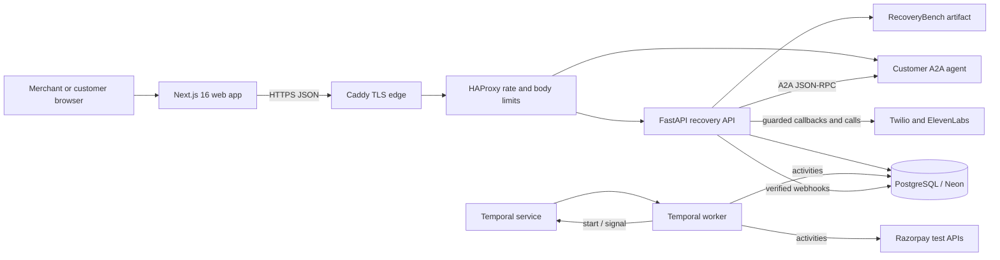

# System architecture

RecoveryOS separates merchant UX, financial truth, durable orchestration, provider adapters, and
customer authorization. External calls and non-determinism stay in activities or API adapters;
Temporal workflow code contains only deterministic state and timers.

The checked-in deployment topology places the web app on Vercel and the API, worker, customer-agent,
Caddy, and HAProxy on an OCI ARM64 VM. Staging and production are isolated Compose projects with
separate Neon roles/branches and Temporal namespaces. Templates do not prove those resources exist;
credentialed provisioning remains an external gate.

## Runtime responsibilities

| Runtime         | Owns                                                                                               | Must not own                                          |
| --------------- | -------------------------------------------------------------------------------------------------- | ----------------------------------------------------- |
| Next.js web     | Control Tower, case workspace, policy UI, lab, voice rehearsal, A2A approval page                  | business authorization, payment truth, server secrets |
| FastAPI API     | merchant-scoped domain services, raw webhook intake, reconciliation, mandate/voice boundaries      | browser-trusted payment completion                    |
| Temporal worker | durable case orchestration, timers, signals, bounded activity retries, cancellation                | direct network calls in workflow code                 |
| PostgreSQL      | cases, independent state axes, audit events, inbox/outbox, idempotent revenue, nonce/voice records | card credentials, OTPs, banking secrets               |
| Customer agent  | exact-scope customer decision and signed mandate                                                   | payment execution or payment-success claims           |
| RecoveryBench   | fixed-seed training/evaluation report and optional score artifact                                  | mutation of merchant accounting                       |

## Durable workflow boundary

Each case runs as `recovery-case:{case_id}` using workflow type `recovery.case.v1`. The workflow
accepts payment, customer-intent, approval, opt-out, cancellation, A2A-update, and mandate signals.
Signal IDs are deduplicated. Standard activities have a 30-second timeout and at most three attempts;
provider submissions use one attempt because an ambiguous response may hide a completed external
action. Reconciliation and cancellation remain available when provider-creation circuit breakers
are open.

## Persistence and accounting

A case is keyed by merchant plus failed invoice, or merchant plus subscription and billing-cycle key
when no invoice exists. Payment, subscription, case, contact, and revenue states are independent.
The webhook inbox and outbox are written atomically. Revenue is unique on merchant, provider, and
provider event ID; all amounts are integer paise. A browser callback is navigation, never proof of
payment.

The database currently has one Alembic head, `27b4eb4b36a1`, covering the core schema, policy
settings, voice persistence, and A2A nonce consumption.

## Current composition gaps

The worker entry point instantiates `MockRecoveryActivityServices`; it does not compose the
Razorpay, A2A mandate-verifier, voice, or RecoveryBench adapters into production activities. The API
can use the Razorpay adapter for merchant-triggered payment surfaces and the webhook outbox worker
performs authoritative provider reconciliation, but the Temporal action path remains mock-backed.
Likewise, the Recovery Agent can delegate to the separate customer agent and the verifier/SQL nonce
store are independently implemented, but no runtime bridge currently polls the approved artifact,
verifies it, and signals the workflow. These are code-integration blockers, not credential-only
gates.
